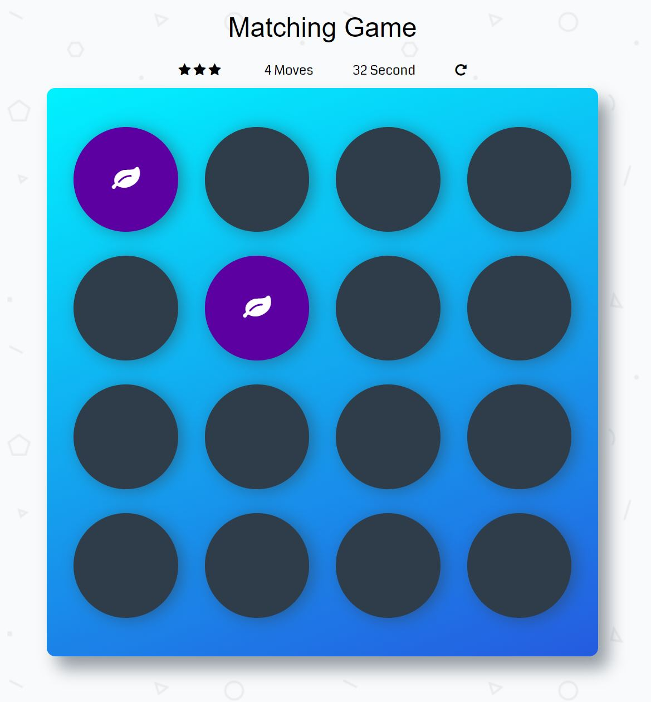

# Introduction
This is a game built to test a users memory. I manipulated the DOM with Vanilla JS. E.g. I created a deck of cards that shuffles when game is refreshed, added effects to cards when they match and unmatched, created a counter to count the number of moves and a game timer and I created a pop-up modal when player wins the game.

# To run
1. Download the application from here
2. Select index.html to start the app

# Game directions and rules
- Click on a card
- Click on a second card, trying to find the corresponding card with the same symbol
- If the cards match, both cards stay flipped over
- If the cards do not match (try remember the symbol of cards), both cards are flipped face down
- The game ends when all cards have been correctly matched
